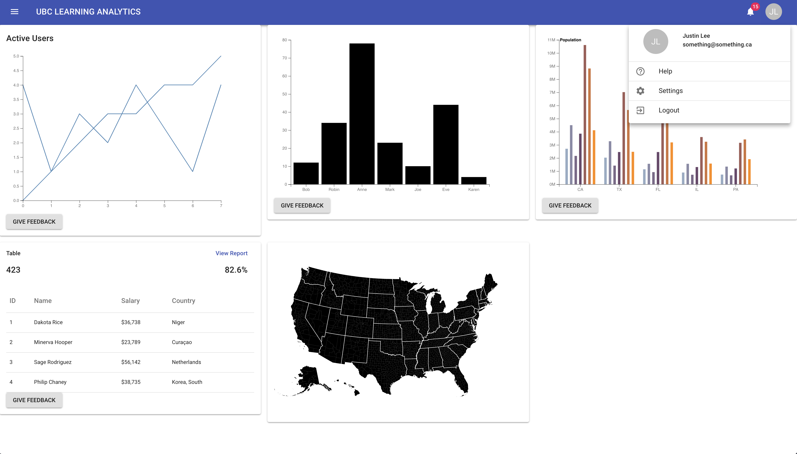

# Dashboard
**[Live Demo](https://justin0022.github.io/dashboard/)**

A React single page data visualiation app. It uses [D3](https://d3js.org/), [Material UI](https://material-ui.com/), [React Router](https://github.com/ReactTraining/react-router), and [Emoji Feedback](https://github.com/ubc/emoji-feedback).

## Getting Started

These instructions will get you a copy of the project up and running on your local machine.

### Prerequisites

1. **Install [Node 8.0.0 or greater](https://nodejs.org)**.
2. **Install [Git](https://git-scm.com/downloads)**.

### Installing and Setup

1. First, clone this repo. `git clone https://github.com/justin0022/dashboard.git`
1. Then cd into the repo. `cd dashboard`
1. Run the installation script. `npm install` (If you see `babel-node: command not found`, you've missed this step.)
1. Run using `npm start`. Webpack Dev Server will host a hot-loading webpage.
1. To build for production, `npm run build` will output the production-ready, minified, tree-shaken bundle in `/dist`.

## Responsive
Using the higher order component [withResponsiveness](https://github.com/justin0022/dashboard/blob/master/src/components/hoc/withResponsiveness.js), the graphs made in D3 is responsive in an optimized way.
